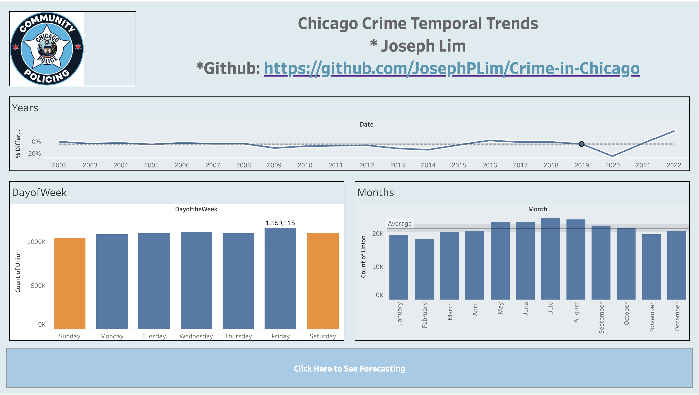

# Project 4
 
This project aimed to visualize Crime in Chicago using both Matplotlib and Seaborn, in addition to Tableau.

Here is a screenshot of the dashboard created in Tableau. 

The full Dashboard can be viewed at the link here:

https://public.tableau.com/views/Chicago-Crime-Dashboard/MainDB?:language=en-US&publish=yes&:display_count=n&:origin=viz_share_link

Project currently being worked on, ReadMe will be updated as project is finished.